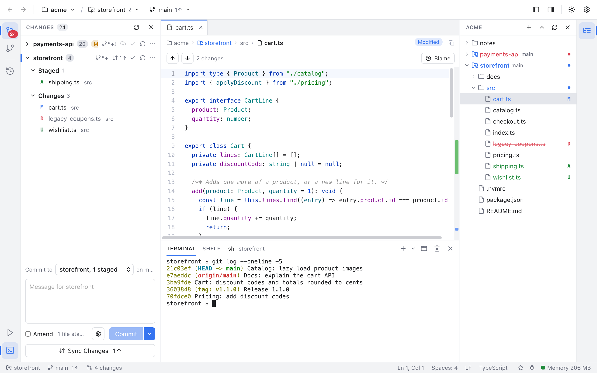
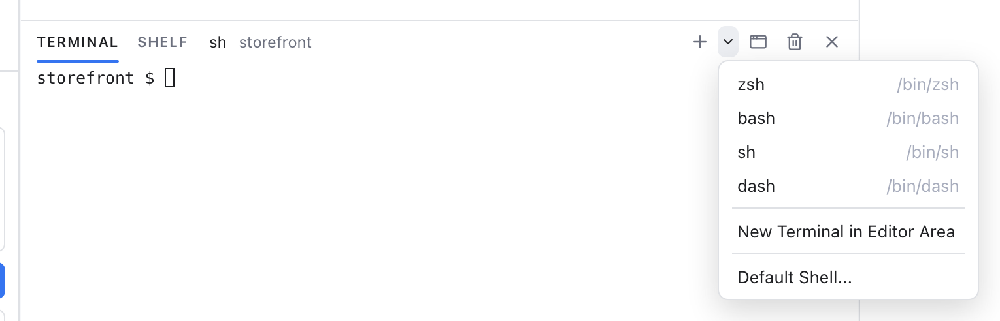
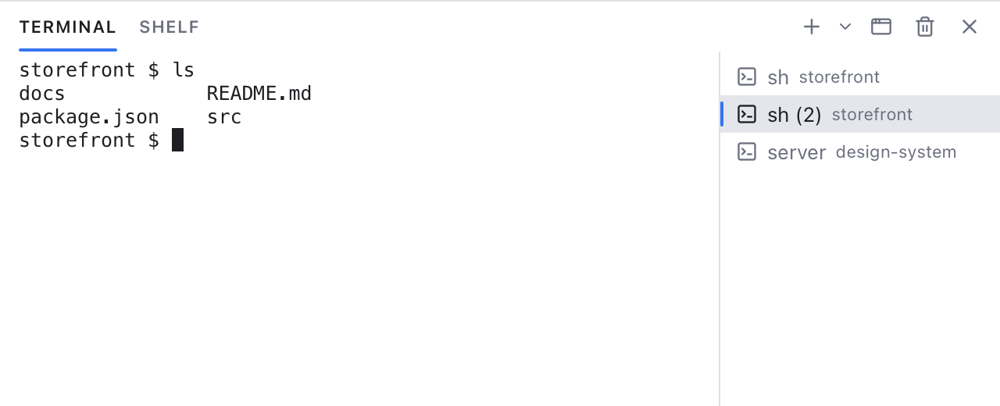
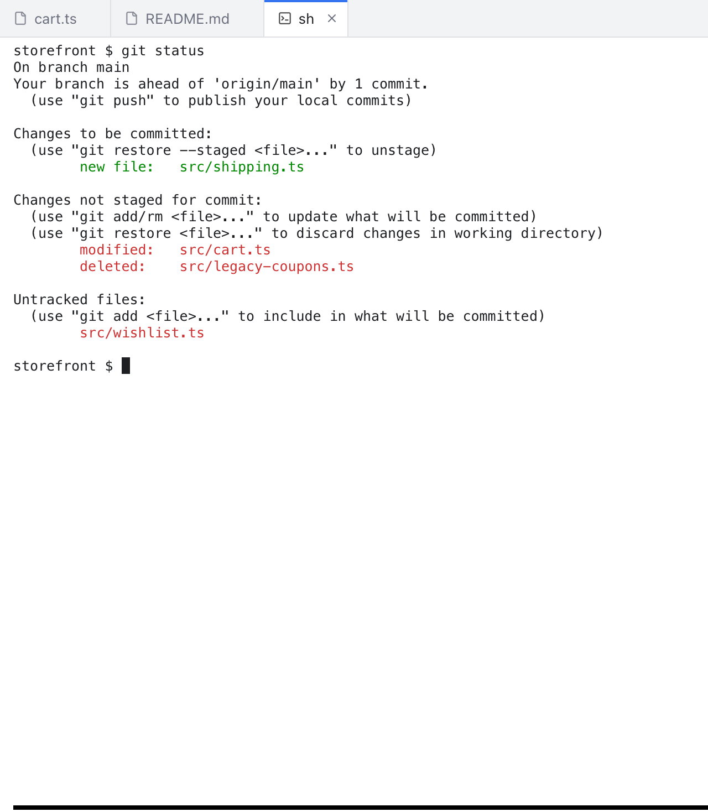
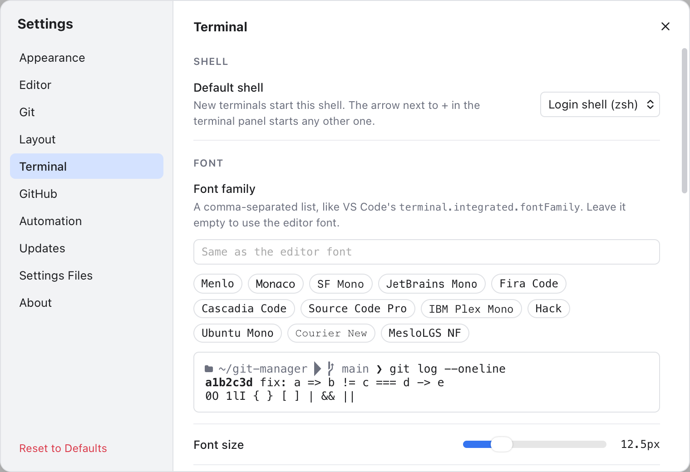

# Terminal

Git Manager has a terminal built in, like VS Code. Run git commands, a dev server or your tests without leaving the window. Each terminal runs a real shell (the program that reads your commands, such as zsh), with your usual prompt, colors and aliases.

*The terminal panel below the editor, with a shell in the shop repository showing its recent commits.*

## Open and hide the terminal

Any of these shows the terminal panel below the editor:

- Click the **Terminal** button at the bottom of the left activity bar (the strip of icons at the window edge).
- Press **Ctrl+`** (Control and the backquote key). It works inside a terminal too.
- Choose **View > Terminal**.

If the panel has no terminal yet, a new one starts. Do the same again to hide the panel. Hiding keeps your shells running, so a dev server or a long build carries on.

A new terminal starts in the active repository. Without one, it starts in the first workspace folder, and without a folder, in your home folder.

Drag the top edge of the panel to change its height, or double-click it to reset. The height is remembered.

## The panel header

The header has tabs on the left. **Terminal** shows your terminals. **Run** appears once you run a project script (see [Scripts](Scripts.md)). **Git Console** appears while it is on in Settings, Git (see [Git Console](Git-Console.md)), and **Shelf** shows the active repository's shelved changes (see [Shelf](Shelf.md)).

On the right of the Terminal tab you find:

- **+** (New Terminal, **Ctrl+Shift+`**): starts another terminal with your default shell.
- **The arrow next to +** (New Terminal With Shell...): a menu with every shell found on your Mac and its path. Below them are **New Terminal in Editor Area** and **Default Shell...**, which opens the Terminal section of Settings.
- **Move Terminal into Editor Area**: moves the shown terminal into an editor tab (see below).
- **Kill Terminal** (trash icon): stops the shown terminal and closes it.
- **x** (Hide Panel, **Ctrl+`**): hides the panel.

*New Terminal With Shell...: each shell with its path, a terminal in the editor area, and the default shell setting.*

## Several terminals

With two or more terminals, a list appears on the right of the panel. Each row shows the terminal's name and the folder it started in. Click a row to show that terminal. Hover a row for its trash button, which kills it.

*Three terminals: the list shows each name and folder, and marks the active one.*

Names follow the shell, like VS Code: the first zsh is "zsh", the next one "zsh (2)", and so on. When a terminal closes, its number is free again.

Drag the line between the terminal and the list to change the list's width, or double-click it to reset. The terminal always keeps enough room, and the width is remembered.

## Right-click menus

Right-click a row in the list, or the terminal name in the header when there is only one, for:

- **New Terminal Here**: a new terminal with the same shell and folder.
- **Rename...**: give the terminal a name of your own (up to 60 characters). It keeps that name.
- **Move Terminal into Editor Area** or **Move Terminal into Panel**.
- **Kill Terminal**.

Right-click inside a terminal for **Copy**, **Select All** and **Clear** first, then the same items.

## Terminals in editor tabs

Choose **Move Terminal into Editor Area** to move a terminal into its own editor tab, next to your files. It is the same terminal: the shell keeps running and its output stays. To start a terminal in a tab right away, pick **New Terminal in Editor Area** from the arrow next to +.

*A terminal in an editor tab, between file tabs. Hover the tab to see its shell and folder.*

The tab shows a terminal icon and the terminal's name. Right-click the tab for the usual Close items, **Move Terminal into Panel** and **Rename...**. Move Terminal into Panel puts it back at the end of the panel's list, still running.

Closing a terminal tab (with x, Close Others, Close All and so on) kills that terminal, like in VS Code.

## Keys, copy and paste

On a Mac:

- **Cmd+C** copies the selection. With nothing selected it does nothing.
- **Cmd+V** pastes, **Cmd+A** selects everything and **Cmd+K** clears the terminal.
- **Cmd+click** a web link to open it in your browser.
- Other Cmd shortcuts, such as Cmd+B, still work in the app. Everything else goes to the shell, so Ctrl+C stops a command as usual.

On Windows and Linux, copy and paste are **Ctrl+Shift+C** and **Ctrl+Shift+V**, and links open with Ctrl+click.

## When a shell ends

- If the shell ends cleanly, with exit code 0 (for example after you type `exit`), the terminal closes.
- If it ends with an error, the terminal stays open with a dim line such as "[Process exited with code 1]", so you can read what happened.
- **Kill Terminal closes at once, without asking.** Git Manager cannot tell whether something important still runs in the shell, so it does what you asked, like VS Code.

If a shell cannot start, the terminal shows the error and a **Retry** button.

Closing the folder or quitting Git Manager stops every terminal, so no shells are left behind.

## Shells and settings

New terminals use your login shell (the one Terminal.app uses) unless you pick another **Default shell** in Settings, Terminal. Git Manager finds the shells listed in `/etc/shells`.

*Settings, Terminal: the default shell and the font options, with a live preview.*

The same section sets the font, the cursor, the scrollback length (how many lines you can scroll back) and **Copy on selection** (copy text as soon as you select it). Changes apply to open terminals right away, and the terminal follows your color theme. Every option is explained in [Terminal, GitHub and Automation Settings](Settings-Terminal-and-Automation.md#terminal).

## Open a terminal from the Files panel

Right-click a folder or a file in the [Files panel](Files-Panel.md) and choose **Open in Integrated Terminal**. A folder opens a terminal in itself; a file opens one in the folder that holds it.

## Related

- [Scripts](Scripts.md)
- [Keyboard Shortcuts](Keyboard-Shortcuts.md)
- [Editor and Tabs](Editor-and-Tabs.md)
- [Settings](Settings.md)
- [How the terminal works (developer)](../developer/How-the-Terminal-Works.md)
