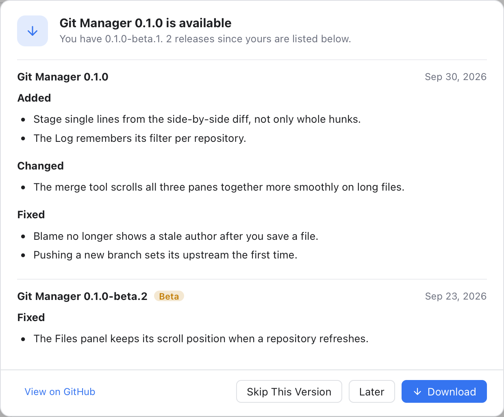
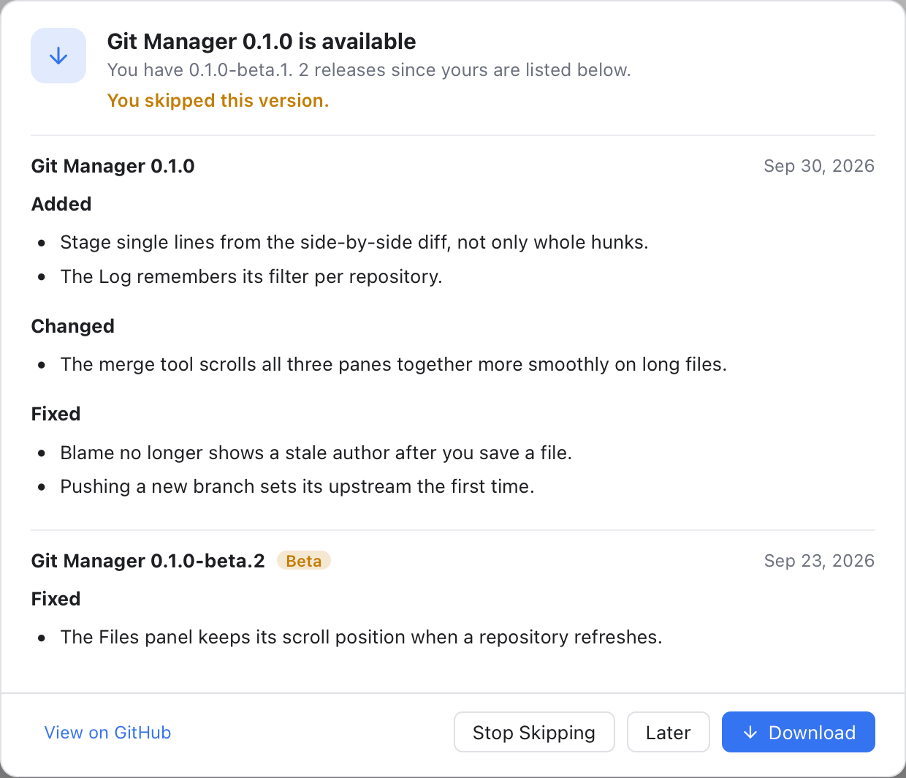
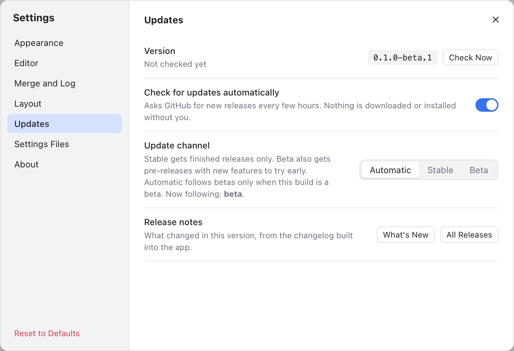
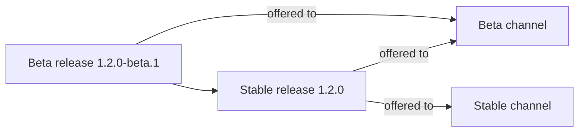
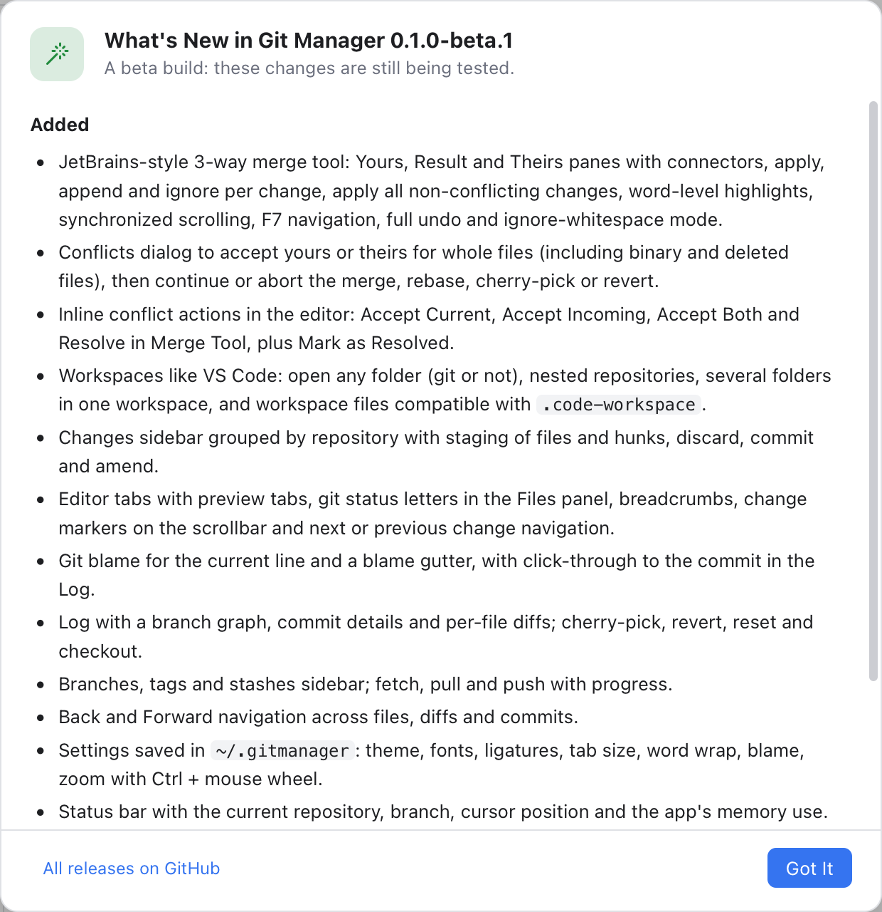

# Updates

Git Manager checks GitHub now and then for a newer version and tells you when one is out. It never downloads or installs anything on its own: you decide when to update.

## How it works

- About 30 seconds after the app starts, and then every 6 hours, it asks GitHub for the list of releases.
- If a newer version is out on your channel, **Update available: 1.2.0** appears on the right of the status bar. A beta adds **(beta)**, as in **Update available: 1.2.0-beta.1 (beta)**.
- Click it to open the update window.

If you are offline, or GitHub does not answer, the automatic check fails quietly and tries again later. Nothing pops up. Windows that git mergetool opens (see [Git Mergetool](Git-Mergetool.md)) do not check for updates or show What's New.

## The update window

*Git Manager 0.1.0 is available: the notes of the two releases since 0.1.0-beta.1, and the buttons.*

The window's title names the new version, such as **Git Manager 0.1.0 is available**. Below it you see the version you have and the notes of every release since yours, newest first, each with its date. Beta releases carry a **Beta** tag. Its buttons:

- **Download** opens the new `.dmg` in your browser (or the release page if there is no `.dmg`).
- **Later** closes the window. The status bar keeps showing the update.
- **Skip This Version** closes the window and stops announcing this version (see below).
- **View on GitHub** opens the release page.

Esc closes the window, like **Later**.

### A version you skipped

After **Skip This Version**, the status bar and the automatic checks stay quiet about that version and any older one. A newer release is announced as usual. Checking by hand with **Check Now** still shows it, marked **You skipped this version.**, with **Stop Skipping** in place of **Skip This Version**.

*Check Now for a skipped 0.1.0: the note You skipped this version. and Stop Skipping in place of Skip This Version.*

**Stop Skipping** undoes the skip, and the status bar shows the update again.

To install, open the downloaded `.dmg` and drag Git Manager into Applications, replacing the old copy. Your settings are kept, since they live in `~/.gitmanager` (see [Settings](Settings.md)).

## Settings, Updates

*The version, the automatic check and the update channel.*

- **Version** shows the version you run and when it last checked: "Not checked yet", "Checking...", "Checked 5 min ago: up to date" or "Last check failed" with the reason. **Check Now** checks right away. If there is a newer version, the update window opens (for a version you skipped, it says so and offers **Stop Skipping**); otherwise a note says **Git Manager is up to date**. If the newest version is one you skipped, the Version line says **(skipped)** after it.
- **Check for updates automatically** (on by default) turns the regular check on or off. **Check Now** still works when it is off.
- **Update channel** picks which releases you hear about (see below). The default is **Automatic**. Changing it checks again at once, quietly.
- **Release notes**: **What's New** shows the notes for your version, **All Releases** opens the list on GitHub.
- **Skipped version** appears after you skip one. **Announce Again** (or **Stop Skipping** in the update window) undoes the skip.

## Stable and beta channels

New features first go out as **betas**, test versions such as `1.2.0-beta.1`. On GitHub they are marked as pre-releases. Once a beta has proven itself, it becomes a **stable** release such as `1.2.0`.

The **Update channel** setting decides which of these you are offered:

- **Stable**: finished releases only.
- **Beta**: betas too, so you can try new features early.
- **Automatic** (the default): a beta build follows betas, a stable build follows stable releases. Settings shows which one it is following now.

A stable install is never moved to a beta unless you choose **Beta** yourself. When a beta line ends in a stable release, beta users are offered that stable release too.

## What's New

*What changed in the version you just installed.*

After you update, **What's New in Git Manager** and the version opens once, the first time the new version starts, and lists what changed. The notes are built into the app, so this works offline. A beta build says "A beta build: these changes are still being tested."

- **Earlier versions** unfolds the notes of older releases.
- **All releases on GitHub** opens the full list.
- **Got It** (or Esc) closes the window.

You can open it again any time from Settings, Updates (**What's New**) or Settings, About (**Release Notes**).

## If the check fails

Click **Check Now** in Settings, Updates: a **Could not check for updates** note shows the reason, and the **Version** line keeps it. Common ones are no internet connection, "GitHub rate limit reached, try again later", or "The update check timed out". See [Troubleshooting](Troubleshooting.md).

## Related

- [Settings](Settings.md)
- [Status Bar and Help](Status-Bar-and-Help.md)
- [Getting Started](Getting-Started.md)
- [Troubleshooting](Troubleshooting.md)
- [How updates work (developer)](../developer/How-Updates-Work.md)
