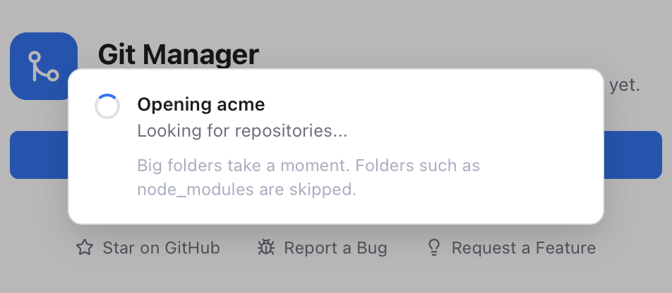
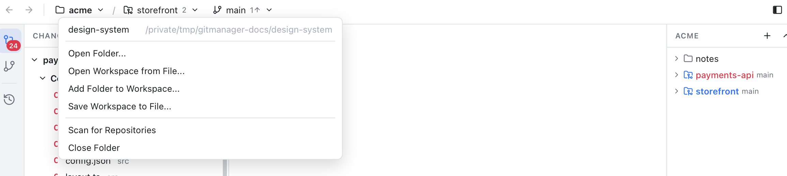
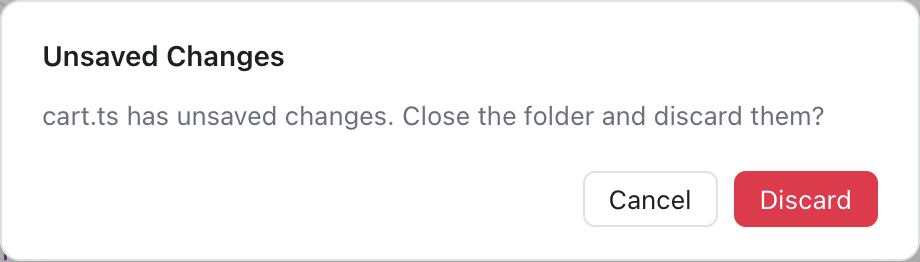
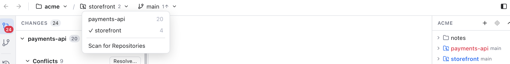
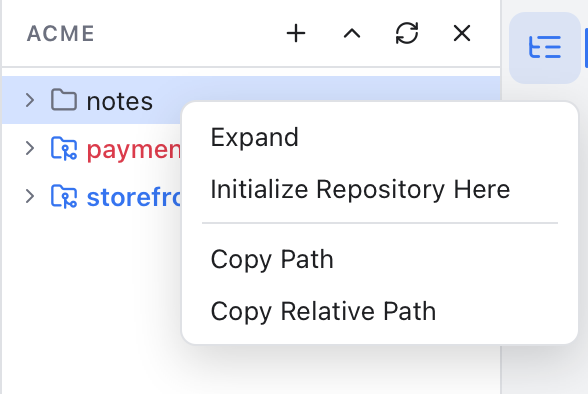

# Workspaces

A workspace is the set of folders you have open, like a multi-root workspace in VS Code. It can hold one repository, many repositories, or none, and Git Manager shows all of them together.

## Open a folder

1. On the [welcome screen](Welcome-Screen.md) click **Open** (or use the folder menu in the header, see below).
2. Pick any folder.

Git Manager then looks for repositories (folders that git tracks) inside it:

- The folder itself, or a repository that contains it.
- Repositories further down, also ones nested inside other repositories, up to six levels deep.
- Folders such as `node_modules`, `vendor`, `build`, `dist`, `target` and `.venv` are skipped, because they never hold repositories worth showing.

### While a big folder opens



*The progress card while Git Manager looks for repositories in a big folder.*

If looking for repositories takes more than a blink, a card says **Opening** and the folder name, with the step, such as **Looking for repositories...**. After a few seconds it adds "Big folders take a moment. Folders such as node_modules are skipped."

Then the window opens and the changes fill in while the status bar counts: **Reading changes 2 of 5**. You can already work.


*A workspace open in the main window. Changes are grouped by repository.*

When you quit, the open folders are remembered and reopened on the next start. After **Close Folder**, the next start shows the welcome screen. If a folder cannot be opened (for example, it was moved), a message names the folder and says why.

## The folder menu

Click the workspace name at the top left of the header. The menu starts with your recent workspace files, workspaces and folders (all but the one open now), then:



*The folder menu of the acme folder: one recent folder, then the open, save, scan and close actions.*

- **Open Folder...** replaces the workspace with another folder.
- **Open Workspace from File...** opens a saved workspace file.
- **Add Folder to Workspace...** adds one more folder next to the ones already open.
- **Save Workspace to File...** (or **Save Workspace As...** once it is saved) writes the folder list to a file. See "Workspace files" below.
- **Remove "name" from Workspace**, one entry per folder, when there are several.
- **Scan for Repositories** looks again. New repositories usually show up on their own (a note says **Found repository**), so you rarely need it.
- **Close Folder** (or **Close Workspace** with several folders) goes back to the welcome screen.

If a tab has unsaved edits, you are asked first (**Discard** or **Cancel**). Opening another folder or workspace asks the same way.



*Close Folder with an edited cart.ts: Discard drops the edits, Cancel keeps everything open.*

## Several folders


*The Files panel with two workspace folders, acme and design-system.*

To add a folder, choose **Add Folder to Workspace...** in the folder menu, or click the **+** at the top of the Files panel. Each folder becomes a top-level entry in the Files panel, and its repositories join the others in Changes. Adding a folder that is already open only shows a note.

With several folders, the workspace name joins the folder names, for example **acme, design-system**.

To remove one, use **Remove "name" from Workspace** in the folder menu, or right-click the folder in the Files panel and choose **Remove Folder from Workspace**. Open tabs from that folder are closed first (you are asked if one has unsaved edits). Removing the last folder closes the workspace.

Workspaces with more than one folder are listed under **Projects** on the [welcome screen](Welcome-Screen.md).

## The active repository

Many views work on one repository at a time: the Branches sidebar, the Log, the conflict banner and the **Git** menu (see [Git Menu](Git-Menu.md)). That one is the **active repository**.



*The repository dropdown in the header. The number in the header counts the repositories, the check mark shows the active one, and the number on each row is its count of changed files.*

You can switch it in several places:

- The repository dropdown in the header. It only appears when the workspace holds more than one repository, or when the repository is not the folder itself. Its last entry is **Scan for Repositories**.
- In **Changes**, the folder icon on a repository header (also in the **No Changes** list), or right-click the header and choose **Set as Active Repository**.
- In the **Files panel**, right-click a repository folder and choose **Set as Active Repository**.
- In the **status bar**, click the repository name to open **Select a Repository**. Its **Auto** entry (on by default) makes the active repository follow the open tab, so opening a file of another repository makes that one active. Picking a repository there turns Auto off. See [Status Bar and Help](Status-Bar-and-Help.md).

Git Manager remembers the active repository for each workspace. Opening the conflicts of another repository, from Changes or the status bar, makes that one active too.

## A folder without git

If the folder has no repository, the Changes sidebar says **No git repository** and offers **Initialize Repository** and **Scan Again**. Initialize runs `git init` in the workspace folder. The Branches sidebar and the Log show the same two buttons, and the header says **No git repository** where the branch would be.



*Right-click a plain folder in the Files panel to turn it into a repository.*

You can also start a repository in a plain subfolder that is not inside another repository: right-click it in the Files panel and choose **Initialize Repository Here**. The new repository becomes the active one.

## Workspace files

A workspace file saves a set of folders so you can reopen them in one click.

1. Open the folders you want.
2. In the folder menu choose **Save Workspace to File...**.
3. Pick a name and place. It starts next to your first folder, and the file ends in `.gitmanager-workspace`.

From then on the workspace is named after the file.

The file is plain JSON. Folder paths are stored relative to the file when they share a parent folder with it, so you can move the whole set together:

```json
{ "folders": [{ "path": "apps/web" }, { "path": "../design-system" }] }
```

**Open Workspace from File...** opens these files and also VS Code `.code-workspace` files. While a workspace is linked to a file, adding or removing folders updates the file and keeps its other settings, folder names and comments. If some folders no longer exist, a note lists them and the rest open.

## Related

- [Getting Started](Getting-Started.md)
- [Files Panel](Files-Panel.md)
- [Changes and Commits](Changes-and-Commits.md)
- [Status Bar and Help](Status-Bar-and-Help.md)
- [How workspaces work (developer)](../developer/How-Workspaces-Work.md)
