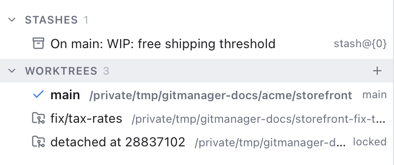
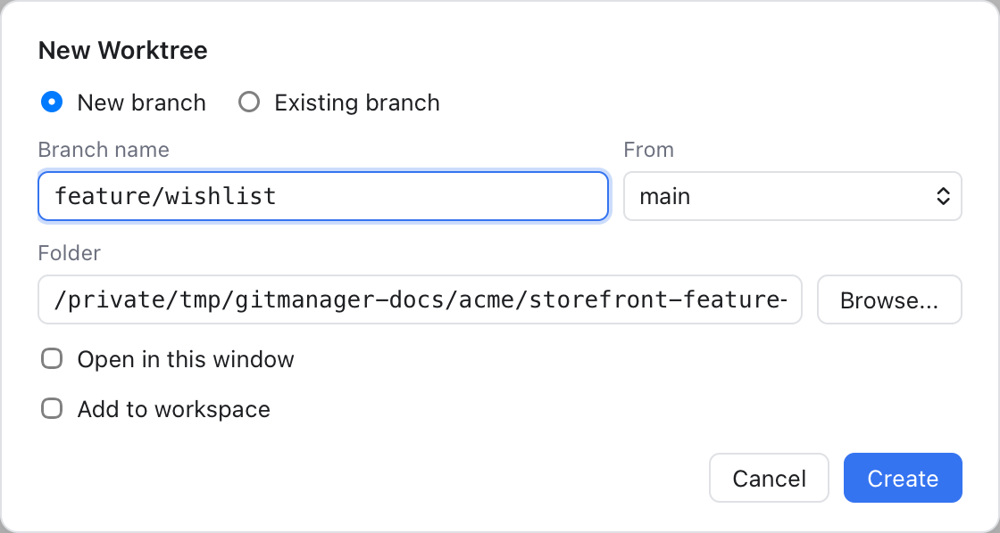

# Worktrees

A worktree is an extra folder that has a different branch of the same repository checked out. Normally a repository has one folder with one branch. With `git worktree`, you can have `main` in one folder and `feature/login` in another at the same time, sharing one history, one set of branches and one `.git` store. Nothing is cloned twice.

Worktrees are handy when you need to look at or fix another branch without stashing or committing half-done work: a quick bug fix, a review, or a long build on one branch while you keep coding on another.

The first folder, the one with the `.git` folder inside, is the **main worktree**. The others are **linked worktrees**.

## See your worktrees

Open the **Branches and Stashes** sidebar (Shift+Cmd+E). **Worktrees** is the last section, after Stashes. **Git > Worktrees > Show Worktrees** opens the sidebar with that section expanded.

Each row shows the branch the worktree has checked out (or "detached at" a commit id) and its folder. The worktree you are in has a check mark and bold text. Small tags say more:

- **main**: the main worktree.
- **locked**: protected from removal and pruning. Hover it for the reason.
- **prunable**: its folder is gone. The row is struck through. Pruning makes git forget such a worktree.

The filter box at the top of the sidebar also searches worktree folders and branches.

In the Changes sidebar, a linked worktree opened as a repository has a **worktree** tag next to its name.

## Create a worktree

Click **+** on the Worktrees heading, right-click the heading and choose **New Worktree...**, or choose **Git > Worktrees > New Worktree...**.

1. Choose **New branch** to create one: type a **Branch name** and pick where it starts in **From**. Or choose **Existing branch** and pick one. Branches already checked out in another worktree are not listed, because git allows a branch in only one worktree at a time.
2. **Folder** starts as `<repository>-<branch>` next to the main worktree, like `storefront-feature-login`. It follows the branch name until you edit it. Click **Browse...** to choose another place. The folder must not exist yet, or be empty.
3. Tick **Open in this window** to switch to the new worktree, or **Add to workspace** to add it as another folder of your workspace. Tick neither to just create it.
4. Click **Create**.

## Work with a worktree

Right-click a worktree row:

- **Open in This Window** opens its folder as your workspace.
- **Add to Workspace** adds its folder next to the ones you have open. See [Workspaces](Workspaces.md).
- **Reveal in Finder** shows the folder.
- **Lock...** asks for an optional reason (for example "On a removable disk") and locks it, so git will not prune or remove it. **Unlock** undoes that. The main worktree cannot be locked.
- **Remove...** deletes the worktree's folder. The branch stays. You are asked first.
- **Prune Stale Worktrees** cleans up worktrees whose folder you deleted by hand.

## Remove a worktree

**Remove...** is disabled for the main worktree, the worktree you are in, a locked one (it reads **Remove (unlock first)**), and a prunable one (prune it instead).

If the worktree has uncommitted or untracked changes, the question is titled **Worktree Has Changes** and the button reads **Force Remove**: those changes are lost. If the worktree is a folder of your workspace, it leaves the workspace first.

## Prune stale worktrees

If you delete a worktree folder in Finder, git still remembers it, and its branch stays "checked out" there. Choose **Prune Stale Worktrees** in the section or row menu, or **Git > Worktrees > Prune Stale Worktrees**. A note says **Pruned stale worktrees**, or **No stale worktrees to prune**.

## Example

You are in the middle of a change on `main` in `storefront` when a bug comes in on `fix/tax-rates`.

1. Click **+** on the Worktrees heading.
2. Choose **Existing branch**, pick `fix/tax-rates`, and leave the folder as `storefront-fix-tax-rates`.
3. Tick **Add to workspace** and click **Create**.
4. Fix and commit in the new folder. Your work on `main` was never touched.
5. Right-click the worktree and choose **Remove...** when you are done.

## Related

- [Branches and Tags](Branches-and-Tags.md)
- [Workspaces](Workspaces.md)
- [Shelf](Shelf.md), shared by all worktrees of a repository
- [How worktrees work (developer)](../developer/How-Worktrees-Work.md)
